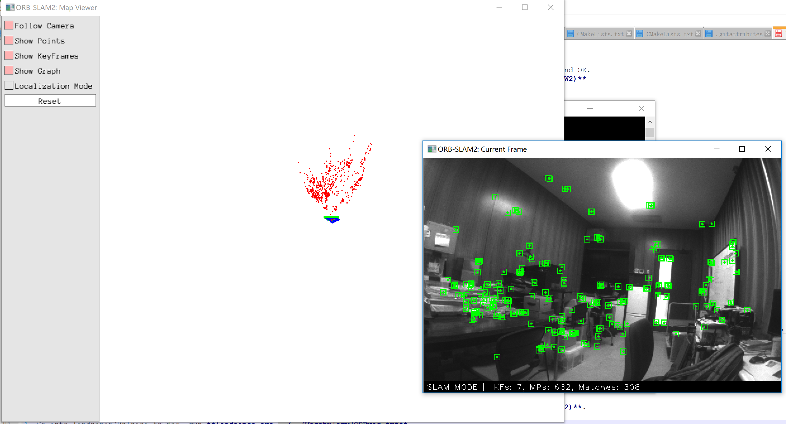

# ORBSLAM24Windows
ORBSLAM2 Project 4(for) Windows Platform

Easy built ORBSLAM2 by Visual Studio on Windows of both debug and release mode

## Thanks
- Original ORBSLAM2 project: [ORB_SLAM2](https://github.com/raulmur/ORB_SLAM2)
- Eigen and Pangolin in Thirdparty are extracted from [Phylliida/orbslam-windows/Thirdparty](https://github.com/Phylliida/orbslam-windows/tree/master/Thirdparty)

## Prerequisite
1. EvoBinoSDK
- Download the latest version of the EvoBinoSDK on [LeadSense official site](http://leadsense.ilooktech.com/developer).
- For more EvoBinoSDK information, read the [Technical Documents](http://leadsense.ilooktech.com/sdk/docs/).
2. OpenCV
 - Version is not required, but not too old. In this tutorial is 3.4.1.
 - Add `YOUR_OWN_PATH\opencv\build;` `YOUR_OWN_PATH\opencv\build\x64\vc12\bin;` to your environment variable "PATH". You can pass this step, if you copy the dll files to folder of the executable file.
3. Cmake
 - Version should at least be 3.1.
4. Visual Studio
 - In this tutorial is VS2017(Corresponding to OpenCV's vc15). 

So, we'll build a visual studio 2017 project of ORB_SLAM2 using cmake and then make a x64 app. 
  
## Steps
First, we'll compile the projects in **Thirdparty** folder.

### DBoW2
1. Open cmake-gui, select DBow2 folder as the source path and the DBow2/build folder as the binaries path.
2. Click configure, select Visual Studio 15 2017 Win64(or your own) as the generator, click Finish.
3. After configure done, click Generate.
4. Go to the DBow2/build folder, double click the DBoW2.sln to open the project (or just click Open Project in cmake-gui).
5. Build ALL_BUILD in either debug or release mode you want.
6. After success build, the DBoW2 library will be in the lib folder of the DBow2 project source folder.

### eigen
**eigen is not need to be built**

### g2o
1. Open cmake-gui, select g2o folder as the source path and the g2o/build folder as the binaries path.
2. Click configure, select Visual Studio 15 2017 Win64(or your own) as the generator, click Finish.
3. After configure done, click Generate.
4. Go to the g2o/build folder, double click the g2o.sln to open the project (or just click Open Project in cmake-gui).
5. Right click on the g2o project->Properties->C/C++->Preprocessor Definitions, add **WINDOWS** at the end row, click Apply and OK.
6. Build ALL_BUILD in either debug or release mode you want. **(Remind to repeat step 5 && Mode should be the same as DBoW2)**
7. After success build, the g2o library will be in the lib folder of the g2o project source folder.

### Pangolin
1. Open cmake-gui, select Pangolin folder as the source path and the Pangolin/build folder as the binaries path.
2. Click configure, select Visual Studio 15 2017 Win64(or your own) as the generator, click Finish.
3. After configure done, click Generate.
4. Go to the Pangolin/build folder, double click the Pangolin.sln to open the project (or just click Open Project in cmake-gui).
5. Build ALL_BUILD in either debug or release mode you want. **(Mode should be the same as DBoW2 && g2o)**.
6. After success build, the Pangolin library will be in the lib folder of the Pangolin project source folder. And the libraries needed by Pangolin will be in Pangolin/external.

### ORBSLAM24Windows
1. If you are trying to bulid Debug version, you may need to change the names of third party libraries in CMakeLists.txt (line 77-84).
2. Open cmake-gui, select ORBSLAM24Windows folder as the source path and the ORBSLAM24Windows/build folder as the binaries path.
3. Click configure, select Visual Studio 15 2017 Win64(or your own) as the generator, click Finish.
4. After configure done, click Generate.
5. Go to the ORBSLAM24Windows/build folder, double click the ORB_SLAM2.sln to open the project.
6. Choose either debug or release mode you want. **(Mode should be the same as DBoW2 && g2o && Pangolin)**.
7. Right click the ORB_SLAM2 project and then click generate. If you want to build leadsense and other samples at the same time, just build ALL_BUILD.
8. After success build, the ORB_SLAM2 library will be in the lib folder of the ORB_SLAM2 project source folder.

### Applications
If you want to make apps, you can also build the mono-stero-RGBD projects provided.

Take mono_tum app as an example, you can follow the steps below.  
1. Go to the ORBSLAM24Windows/build folder, double click the ORB_SLAM2.sln to open the peoject.
2. Choose either debug or release mode you want. **(Build mode should be the same as DBoW2 && g2o && Pangolin && ORB_SLAM2)**.
3. Right click the mono_tum project and then click generate.
4. Download tum dataset sequence, for example [freiburg2_desk ](http://filecremers3.informatik.tu-muenchen.de/rgbd/dataset/freiburg2/rgbd_dataset_freiburg2_desk.tgz)
5. Right click the mono_tum project and then click Property->Config Property->Debug, input three parameters (Usage: ./mono_tum path_to_vocabulary path_to_settings path_to_sequence, the first can be ignored in windows)
 - **path_to_vocabulary** In ORBSLAM24Windows/Vocabulary folder, unpack the tar, a .txt file
 - **path_to_settings** In ORBSLAM24Windows/Examples/Monocular folder, rgbd_dataset_freiburg2_desk corresponding to TUM2.yaml
 - **path_to_sequence** rgbd_dataset_freiburg2_desk folder path
6. Run app, it'll take a few minutes to load the vocabulary dictionary, and then you'll get the result.

### Leadsense
To build leadsense sample program,  you can follow the steps below.
1. Go to the ORBSLAM24Windows/build folder, double click the ORB_SLAM2.sln to open the peoject.
2. Choose either debug or release mode you want. **(Build mode should be the same as DBoW2 && g2o && Pangolin && ORB_SLAM2)**.
3. Right click the leadsense project and then click generate.
4. Go into the executable file folder (eg. leadsense/Release), run **leadsense.exe ../../Vocabulary/ORBvoc.txt**.

**Important**
If you don't satisfied with the speed of loading dictionary, you can reference issue [vocabulary convert](https://github.com/raulmur/ORB_SLAM2/pull/21) to convert the txt vocabulary  to bin vocabulary, it speeds up a lot.

The picture shows the result using Leadsense.

